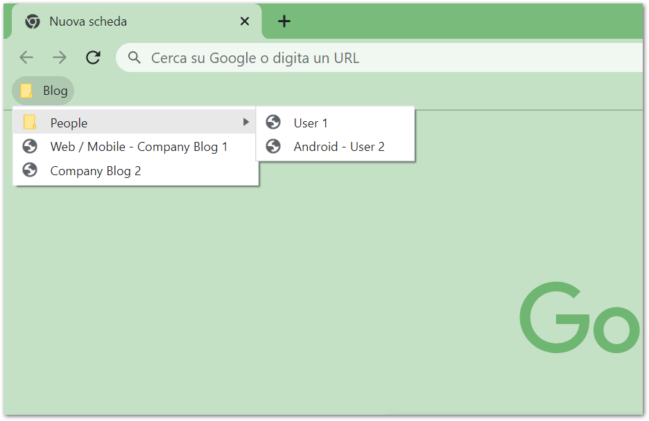
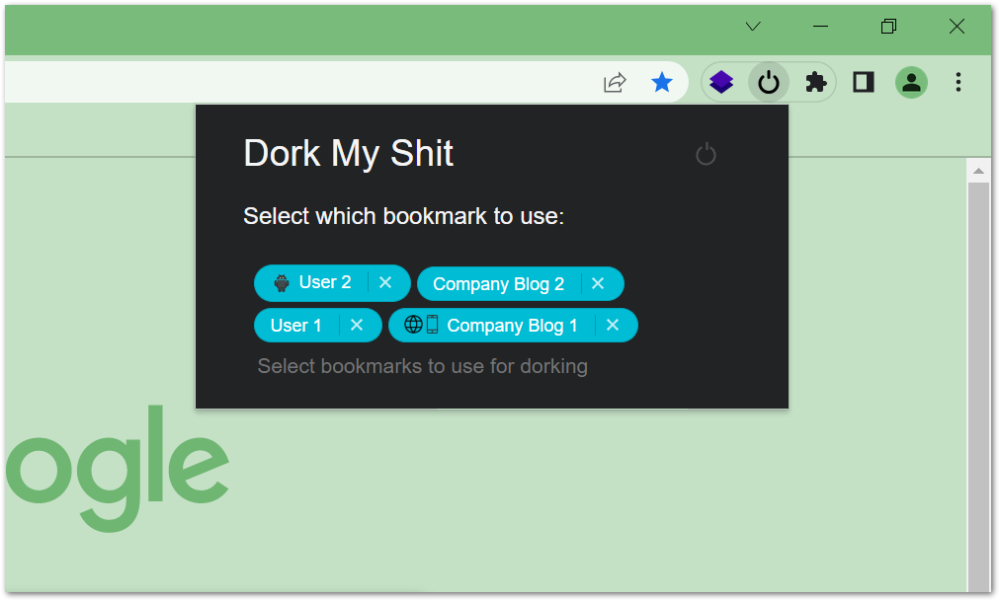
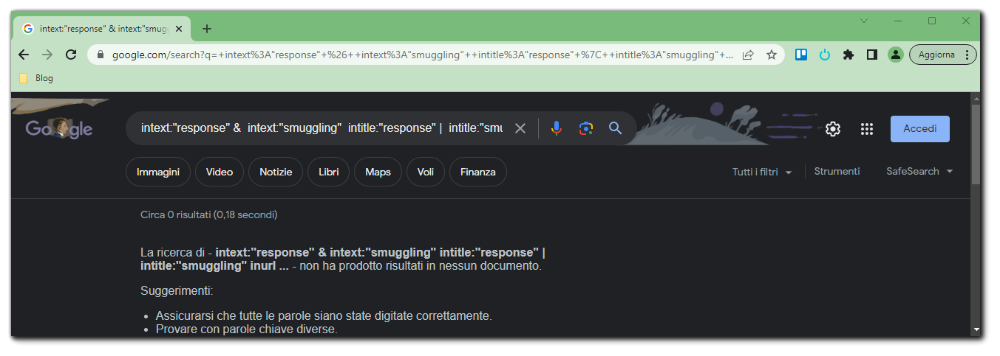

# DorkMyShit
*(latest update: v1.1.0)*

A Chrome extension that allows you to restrict Google searches to your favorite bookmarks. The idea comes from the need to limit Google searches on specific topics to blogs of people/companies that have published articles of interest on the topic being searched for, thereby avoiding falling into useless links from companies that only sell fluff but pay a lot of money to have their pages appear first.

## How to install it

Clone the repo or download it as a zip file:
```
git clone https://github.com/serrapa/DorkMyShit.git
```

Then:
1. open [chrome://extensions/](chrome://extensions/)
2. enable the developer mode 
3. click on **load unpackaged extension**
4. choose the folder you have just downloaded (should be unzipped)


## How to use it
First, you need to set a default bookmark directory from the settings panel (the default is ***Blog***) since the extension will rely on it to obtain the domains you want to limit the searches for. Then, the extension will build the google dorks based on the selected bookmarks.

 

The extension will create the following google dork while searching for `response smuggling`:
 

Inside the default directory, you can have as many subdirectories as you want, for example, you can divide people from companies, or among different topics.

At the moment, the extension shows some icons for certain bookmarks based on their name:
- if the bookmark name is something like "Android - User 1", the extension replaces the "Android - " part with the Android icon. 
- if the bookmark name is something like "Web / Mobile - User 1", the extension replaces the "Web / Mobile - " part with the web and mobile icons. 

## Why these google dorks?

`site:example.com | site:example2.com`: This indicates that the search will be limited to the specific domains "example.com" and "example2.com". The domains are taken from the bookmarks.

`intext:"keyword1" & intext:"keyword2" & intext:"keyword3"` : This part of the dork limits the search to pages that contain at least one of the specified keywords in their content. As you may notice, here it is used the *&* operator because each keyword should be present in the text in order to be sure the results obtained talk about what you are looking for and it is not just a reference to another page. 

`intitle:"keyword1" | intitle:"keyword2" | intitle:"keyword3"` : This part of the dork limits the search to page titles that contain at least one of the specified keywords. 

`inurl:"keyword1" | inurl:"keyword2" | inurl:"keyword3"` : This part of the dork specifies that the searched keyword should appear also in the URL of pages. In this way, we strengthen the entire dork to get more accurated results and not just references to what we are looking for.


### Supported Icons
- Android
- iOS
- Mobile
- Web
- API


### In program
- search inside your twitter likes